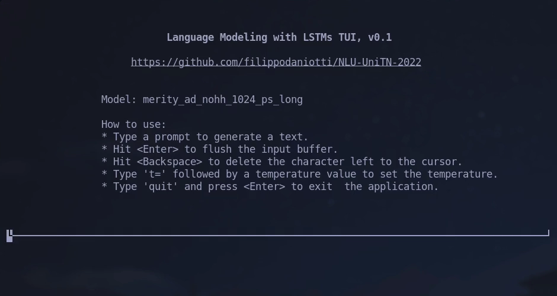

# Adopting LSTMs as language models
This repository containes the code for the final project for the course *Natural Language Understanding*, held at the University of Trento in the A.Y. 2021/2022. The goal of the project is to implement a *language model* based on LSTMs and to evaluate its performances on the word-level Penn Treebank dataset and achieve a perplexity score $\le$ 90.7.  

In this work:
- we analyzed the dataset;
- we implemented and trained a baseline LSTM model and a refined regularized LSTM model;
- we fine-tuned the refined model and improved it with additional regularization techniques from the literature;
- we evaluated the models and performed an in-depth analysis of the best performing model behavior;
- we created a TUI application to easily interact with the model and use it to generate sentences.

The final model achieved a perplexity score of 79.86 on the test set. For further detailes, check the [project report](./static/main.pdf).



## How to run
> Nota: the training logs and trained models weights of the experiments performed are attached to the release of this repository. 

The `run.py` script is the main API for interacting for this project. It also takes care of data download and preparation. Keep in mind that a configuration file is always required for it to run (see [here](#configuration) for details). 

```text
usage: run.py [-h] [-c CONFIG_PATH] [-t] [-e] [-d] [-i] [-ic INFERENCE_CONFIG_PATH] [-it] [-p PROMPT]

Base interface for training, evaluation and inference

options:
  -h, --help            show this help message and exit
  -c CONFIG_PATH, --config CONFIG_PATH
                        Path of configuration file
  -t, --t               Flag for train mode
  -e, --evaluate        Flag for evaluation mode
  -d, --dump-results    Flag for dumping test outputs object after test run
  -i, --inference       Flag for inference mode
  -ic INFERENCE_CONFIG_PATH, --inference-config INFERENCE_CONFIG_PATH
                        Path of inference configuration file. Defaults to 'configs/inference.yaml'
  -it, --interactive    Flag for interactive inference mode
  -p PROMPT, --prompt PROMPT
                        Prompt for inference mode
```

### Setup
We recommend to use `venv` for this project:
- create the `venv`, e.g. `python3 -m venv venv`
- source the `venv`:
    - Unix-ish `source venv/bin/activate`
    - Win `.\venv\Scripts\activate.bat`
- Install requirements: `pip install -r requirements.txt`

### Train

```bash
python3 run.py -c configs/baseline.yaml -t
```

### Evaluate
#### Validation and test set
```bash
python3 run.py -c configs/merity_ad_nohh_1024_ps_long.yaml -e
```
#### Dump outputs
```bash
python3 run.py -c configs/merity_ad_nohh_1024_ps_long.yaml -e -d
```
This will save the outputs of the test run to a `results/<experiment_name>.pkl` pickle object, where `<experiment_name>` is as defined in the provided [configuration file](#experiment-configuration).

### Inference
> Nota: Inference mode requires a dumped Lang object to be passed. The path of the dump can be specified in the [inference configuration file](#inference-configuration). For more info, see [here](#tools).  
#### Single pass
```bash
python3 run.py -c configs/merity_ad_nohh_1024_ps_long.yaml -i -p "the price"
```
#### Interactive
```bash
python3 run.py -c configs/merity_ad_nohh_1024_ps_long.yaml -i -it
```

## Notebooks
| Notebook | Content |
| --- | --- |
| [dataset_analysis](notebooks/dataset_analysis.ipynb) | Analysis of the word-level Penn Treebank dataset. | 
| [training_logs](notebooks/training_logs.ipynb) | Plots of training and validation curves. It requires the results to be parsed with the [`prepare_results.py` tool](#prepare_resultspy). | 
| [evaluation_logs](notebooks/evaluation_logs.ipynb) | Results of evaluation runs. | 
| [results_analysis](notebooks/results_analysis.ipynb) | In-depth analysis of the best-performing model performance and behaviour. It requires the [pickle object containing the outputs of the test run](#dump-outputs) of the model to be analyzed. |

## Tools
### `dump_lang.py`
The `dump_lang.py` script dumps the Lang object as a pickle. The Lang object provides access to the word mappings and it is required a dump of it in order to run [inference](#inference).
```bash
python3 tools/dump_lang.py lang.pkl
```
### `prepare_results.py`
```bash
python3 tools/prepare_results.py -l runs -d results
```
In this project we use the Pytorch Lightning implementation of a Tensorboard logger. The `prepare_results.py` takes the directory of the logs (e.g. `logs/`) of $n$ in the `TensorBoardLogger` directory structure and transforms them into a new folder (e.g. `results/`) in the following format:
```text
results
├── csv
│   ├── experiment_1.csv
│   └── ...
├── tensorboard
│   ├── experiment_1
│   │   └── events.out.tfevents.1693748462.MSI.22648.0
│   └── ...
│       └── ...
└── weights
    ├── experiment_1.ckpt
    └── ...
```
- `csv`: contains the logs of the experiment(s) converted to the csv format
- `tensorboard`: contains the logs of the experiment(s) in the original Tensorboard format
- `weights`: contains the state dictionary of the model of the given experiment at the best validation loss value

The `results/` directory may also contain a `outputs/` subdirectory, which is generated from the [evaluation with dump outputs](#dump-outputseval) and contains the pickle objects of the outputs of test run of the given model.


## Configuration
### Experiment configuration
Each *experiment* is associated to a *configuration file* defined in the YAML format. 

The configurations for all the experiments performed for this project are located in the `/language-modeling/configs` directory and look like this:
```yaml
# file: language-modeling/configs/merity_ad_nohh_1024_ps_tbptt_long.yaml
dataset:
  ds_url: https://data.deepai.org/ptbdataset.zip
  ds_path: penn_treebank
  pad_value: 0

results: 
  logs_path: runs
  results_path: results

experiment:
  seed: 42
  experiment_name: merity_ad_nohh_1024_ps_tbptt_long
  epochs: 200
  early_stopping: 10
  batch_size: 128
  model: merity
  optimizer: sgd
  learning_rate: 1
  ntasgd: 3
  asgd_lr: 1
  gradient_clip_val: 0.25
  tbptt: True
  tbptt_config:
    mu: 30
    std: 5
    p: .95
  part_shuffle: True

model:
  embedding_dim: 1024
  hidden_dim: 1024
  num_layers: 2
  init_weights: True
  tie_weights: True
  locked_dropout: True
  p_lockdrop: .65
  embedding_dropout: True
  p_embdrop: .2
  weight_dropout: True
  p_lstmdrop: .4
  p_hiddrop: .0

```  
If you wish to use some custom configuration for an experiment, you can duplicate and modify one of the existing ones. Please note that invalid configuration modifications may raise errors at runtime.

### Inference configuration
A custom configuration for the [inference modes](#inference) can be defined and passed to the [`run.py` script](#how-to-run). Otherwise, the default configuration will be used:
```yaml
# file: language-modeling/configs/inference.yaml
mode: multinomial
allow_unk: True
max_length: 30
lang_path: 
  - lang.pkl
temperatures:
  - 1.0
  - 0.8
  - 0.75
  - 0.7
  - 0.5
```

